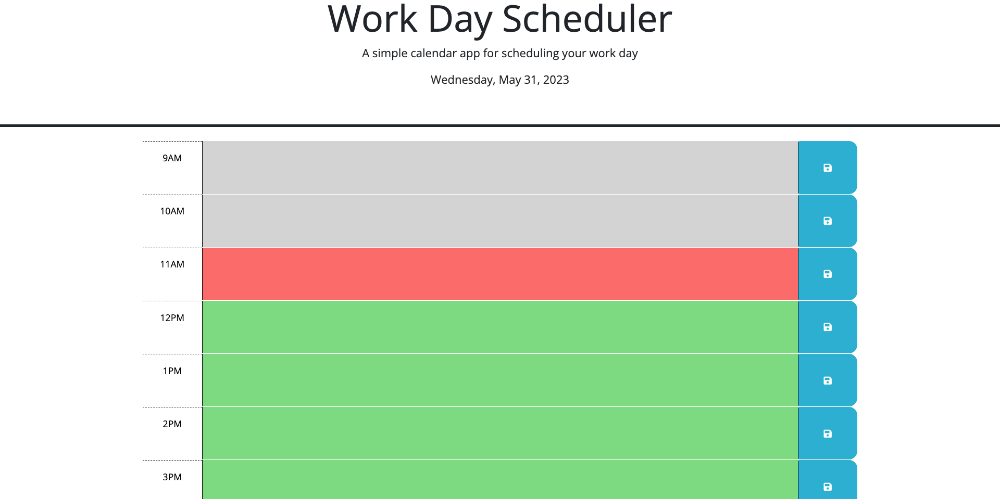

## Name
Work Day Scheduler created for Challenge 05 of the Third-Party APIs module completed through Coding Bootcamp

## Description
Work Day Scheduler allows you to plan your tasks out on a daily basis using business hours that are set (i.e. 9AM-5PM)

## Visuals

## Usage
Visit the URL below to access the Work Day Scheduler. Once the page is loaded, you can enter tasks on each time slot and use the associated save-button on the right-hand side to ensure it's kept if you move away from the page. Scheduler will display the current date at the top of the page in the header section. Blocks are color-coded in Grey, Red or Green depending if it's Past, Present or Future time slots. This is decided on the users' local time on their system.

Direct URL: https://elitehuskie.github.io/module-05-work-day-scheduler/

## License
Using standard MIT license